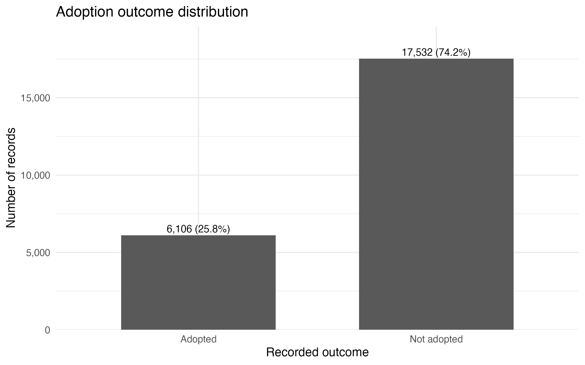
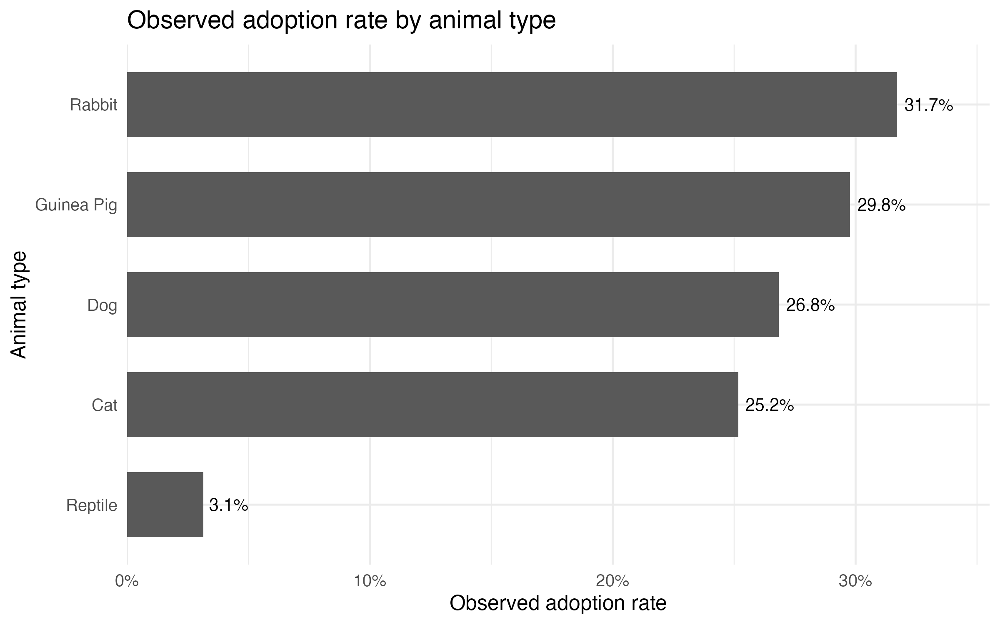
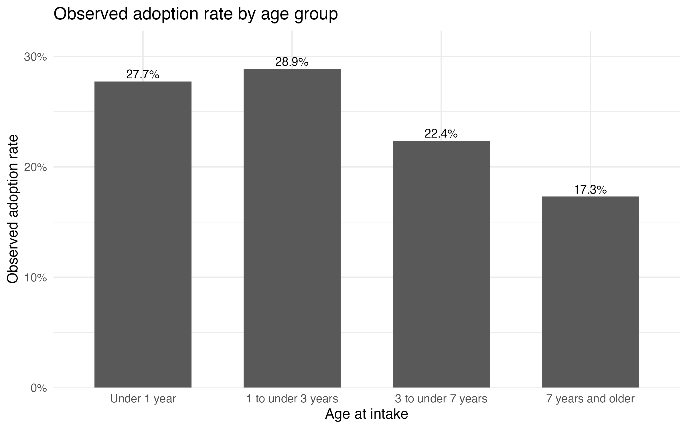
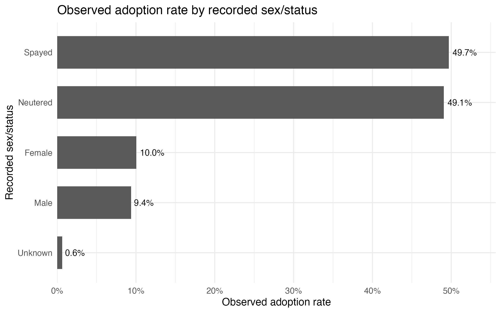
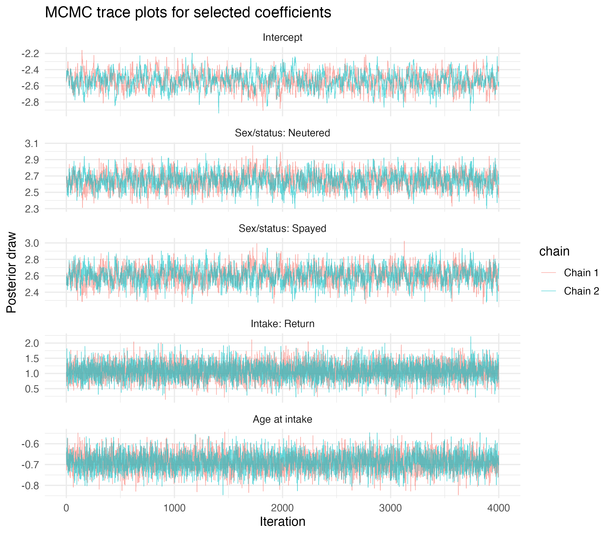
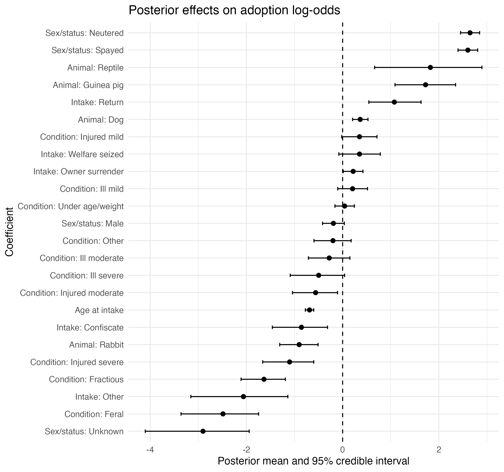
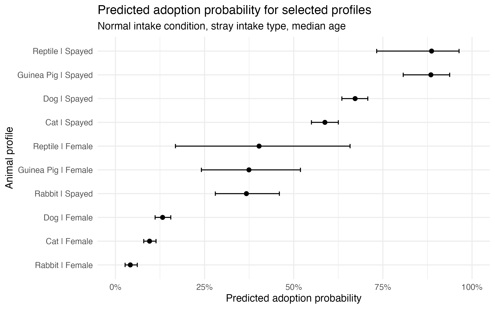

# Bayesian Analysis of Animal Shelter Adoption Outcomes

Animal shelters collect detailed intake and outcome records, but raw records alone do not directly explain which animals are more or less likely to be adopted. This project uses Bayesian modelling to analyse Long Beach Animal Shelter records and estimate how animal and intake characteristics are associated with adoption outcomes.

The goal is to turn shelter data into a clear, reproducible, and decision-oriented analysis that can support adoption planning, outreach prioritisation, and resource allocation.

---

## Project Overview

This project investigates adoption outcomes using shelter intake and outcome records from Long Beach Animal Shelter. The analysis focuses on common adoptable pet types and models the probability that a shelter record results in adoption.

Rather than only reporting raw adoption rates, the project uses a Bayesian approach to quantify uncertainty around model estimates and compare adoption probabilities across selected animal profiles.

The analysis is built as a reproducible workflow using R, Quarto, JAGS, and MCMC diagnostics.

---

## Research Question

**Which animal and intake characteristics are associated with the probability of adoption among common adoptable pets at Long Beach Animal Shelter?**

---

## Why This Problem Matters

Animal shelters often operate with limited staff, space, and outreach resources. Understanding which records are associated with lower adoption probability can help shelters identify groups that may need additional visibility, targeted promotion, medical or behavioural support, or adoption-focused planning.

This project does not claim to prove causal effects. Instead, it provides a Bayesian association analysis that helps identify meaningful patterns in adoption outcomes while explicitly representing statistical uncertainty.

---

## Dataset

The dataset comes from TidyTuesday 2025 Week 9 and is based on Long Beach Animal Care Services shelter records.

Dataset page:  
https://github.com/rfordatascience/tidytuesday/tree/main/data/2025/2025-03-04

The raw dataset contains shelter intake and outcome records, including animal characteristics, intake details, dates, and final recorded outcomes.

The raw dataset is stored in:

```text
data/raw/longbeach.csv
```

---

## Analysis Scope

The analysis focuses on common adoptable pet types:

- Cats
- Dogs
- Rabbits
- Guinea pigs
- Reptiles

The response variable is defined as:

```text
Adopted = 1 if the recorded outcome is adoption
Adopted = 0 for other observed shelter outcomes
```

The final modelling dataset includes:

| Metric | Value |
|---|---:|
| Clean modelling records | 23,638 |
| Adopted records | 6,106 |
| Non-adoption records | 17,532 |
| Adoption rate | 25.8% |

---

## Methods

This project uses a Bayesian logistic regression model to estimate adoption probability from animal and intake characteristics.

Predictors used in the model:

- Animal type
- Recorded sex/status
- Intake condition
- Intake type
- Age at intake

The model was fitted using JAGS with Markov Chain Monte Carlo sampling. Posterior convergence was assessed using:

- Trace plots
- Gelman-Rubin Rhat
- Effective sample size

A reproducible stratified MCMC sample was used for model fitting to reduce runtime while preserving the adoption/non-adoption balance.

---

## Key Visuals

### Adoption Outcome Distribution



The cleaned dataset is imbalanced, with non-adoption records forming the majority of observed outcomes.

---

### Observed Adoption Rate by Animal Type



Observed adoption rates vary across animal types. These are raw, unadjusted rates before controlling for other predictors.

---

### Observed Adoption Rate by Age Group



Older animals show lower observed adoption rates compared with younger animals, suggesting that age is an important predictor to include in the Bayesian model.

---

### Observed Adoption Rate by Recorded Sex/Status



Records marked as spayed or neutered have much higher observed adoption rates than records marked only as female or male. This variable is interpreted carefully because it combines biological sex and sterilisation status.

---

### MCMC Trace Plots



Trace plots were used to visually assess posterior sampling behaviour across selected model coefficients.

---

### Posterior Effects on Adoption Log-Odds



Posterior coefficient intervals show which animal and intake characteristics are associated with higher or lower adoption log-odds, while also showing uncertainty around each effect.

---

### Predicted Adoption Probabilities



Predicted probabilities translate posterior log-odds into more interpretable adoption probability estimates for selected animal profiles.

---

## Main Findings

The Bayesian model suggests that adoption probability is meaningfully associated with animal and intake characteristics.

Key findings:

- Records marked as spayed or neutered are strongly associated with higher adoption probability.
- Older age at intake is associated with lower adoption probability.
- Adoption probability differs across animal types.
- Records with unknown sex/status, feral or fractious intake condition, and other intake type are associated with lower adoption log-odds.
- Some smaller animal-type categories have wider credible intervals, meaning the model is more uncertain for those groups.

These results are associations, not causal effects.

---

## Model Diagnostics

The MCMC diagnostics supported the use of the posterior samples for interpretation.

| Diagnostic | Result |
|---|---:|
| Number of chains | 2 |
| Retained posterior draws | 8,000 |
| Maximum Rhat | 1.001 |
| Minimum effective sample size | 670 |

The maximum Rhat value was very close to 1, indicating good agreement between chains. Trace plots also showed stable sampling behaviour for selected coefficients.

---

## Repository Structure

```text
bayesian-animal-shelter-adoption/
├── analysis/
│   ├── bayesian_logistic_adoption_analysis.qmd
│   └── bayesian_logistic_adoption_analysis.pdf
├── data/
│   ├── raw/
│   │   └── longbeach.csv
│   └── processed/
├── outputs/
│   ├── figures/
│   ├── tables/
│   └── model/
├── presentation/
├── docs/
├── README.md
├── .gitignore
└── LICENSE
```

---

## How to Run the Project

1. Clone the repository:

```bash
git clone https://github.com/ayan978/bayesian-adoption-outcome-modeling.git
```

2. Open the project folder in RStudio.

3. Make sure JAGS and the required R packages are installed.

Required R packages include:

```r
tidyverse
lubridate
knitr
rjags
coda
scales
```

4. Render the Quarto report:

```bash
quarto render analysis/bayesian_logistic_adoption_analysis.qmd
```

The rendered PDF report will be created inside the `analysis/` folder.

---

## Important Notes

- The `.qmd` file contains the full reproducible analysis workflow.
- The PDF report is designed as a polished analysis report with code hidden by default.
- Posterior samples are cached locally as `.rds` files to avoid refitting the Bayesian model on every render.
- Cached model objects are intentionally excluded from GitHub using `.gitignore`.

---

## Limitations

This project uses observational shelter records, so the results should not be interpreted as causal effects. Some variables, especially recorded sex/status, may partly reflect shelter processes that occur before adoption. Smaller animal categories also produce wider posterior intervals, meaning predictions for those groups should be interpreted with greater caution.

---

## Tools Used

- R
- Quarto
- JAGS
- rjags
- coda
- tidyverse
- ggplot2

---

## Project Status

Core analysis completed. The project includes data cleaning, exploratory analysis, Bayesian model fitting, MCMC diagnostics, posterior interpretation, predicted probability visualisation, and a rendered PDF report.